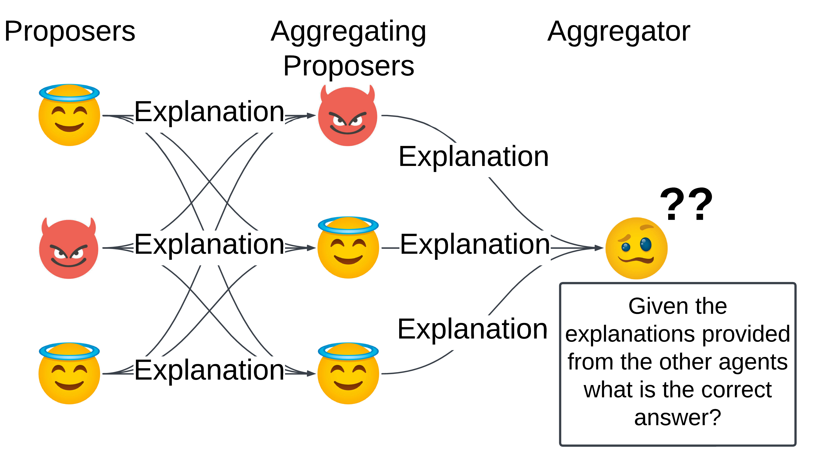
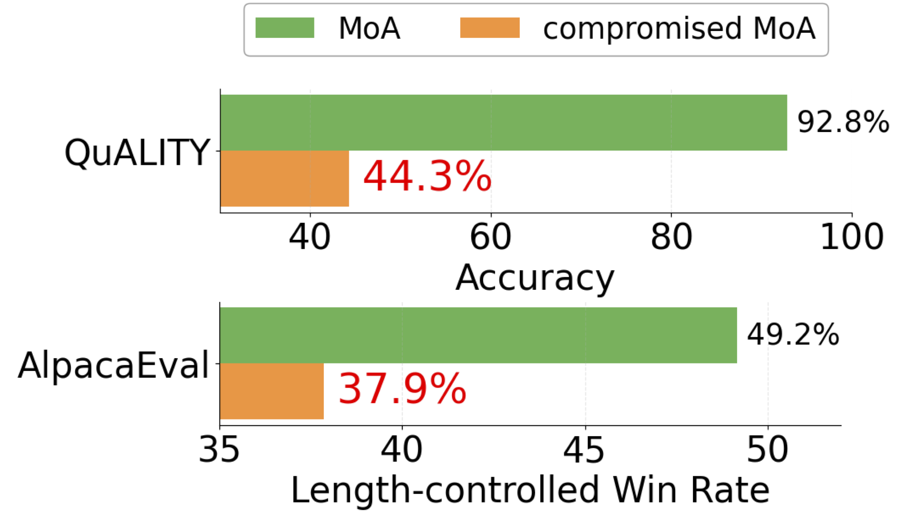

# Robust Mixture-of-Agents

Lorenz Wolf, Sangwoong Yoon, Ilija Bogunovic

This is the official repository for the paper [This is your Doge: Exploring Deception and Robustness in Mixture-of-LLMs](https://arxiv.org/abs/2503.05856).


## Overview

We investigate the effect of deceptive agents on the performance of the popular Mixture of Agents architecture (MoA) uncovering severe robustness and reliability issues. In an initial step toward mitigating the vulnerabilities of MoA we propose several unsupervised defense mechanisms that recover a large proportion of the lost performance.



## Preparation

```bash
# install requirements
pip install -r requirements.txt
cd alpaca_eval
pip install -e .
cd FastChat
pip install -e ".[model_worker,llm_judge]"
cd ..

# setup api keys
export TOGETHER_API_KEY=<TOGETHER_API_KEY>
export OPENAI_API_KEY=<OPENAI_API_KEY>
```

## Examples

To run MoA on the quality task with partial information, Mixtral as aggregator and all truthful agents, execute
```python
python main.py
```

If you want to instead include a deceptive agent in the MoA on the quality task with partial information, you can then place 1 deceptive agent, which ignores references, in the second layer by executing the following comnmand
```python
python main.py deceptive=000_003_ignore
```

To run MoA on alpaca with Llama-3.1-70B-Instruct as aggregator and 1 deceptive agent in the second layer you can run
```python
python main.py experiment=alpaca moa=llama_70B deceptive.deceptive_model_dict_name="000_001"
```


## Expected Results




## Specifying Configurations
The config files are organised in conf/ and split between moa, experiment, deceptive, prompts (prompts is only used for alpaca eval).

The main `Config` consists of four primary components defined in `conf/`:
- Mixture of Agents (MoA) configuration `moa`
- Experiment configuration `experiment`
- Deceptive behavior configuration `deceptive`
- Prompts configuration `prompts` (prompts is only used for alpaca eval)

For specific examples please refer to the corresponding directories and `.yaml` files.

### MoAConfig

Configuration for the Mixture of Agents.

```python
class MoAConfig:
    aggregator: str               # Aggregator type/name
    reference_models: List[str]   # List of reference models to use
    temperature: float = 0.7      # Temperature for model outputs
    max_tokens: int = 2048       # Maximum tokens for generation
    rounds: int = 1              # Number of rounds to run
```

### DeceptiveConfig

Settings for deceptive agents within the MoA.

```python
class DeceptiveConfig:
    deceptive_model_dict_name: Optional[str] = None  # Name of deceptive model dictionary, none corresponds to all truthful agents
    deceptive_ignore_refs: bool = False              # Whether to ignore references in deceptive detection
```
Deceptive agents are specified via the `deceptive_model_dict_name`. 

In all cases each agent is assigned an integer encoding its deceptive status.
- On both tasks truthful agents are denoted with status `0`. 
- Deceptive agents on AlpacaEval are instantiated with status `1`.
- For Quality promoters are denoted with status `2` and opposers with status `3`

Our implementation supports the following approaches of specifying the entire configuration:
- Hard coded locations of deceptive agents
- Random sampling of locations

#### Hard coded
Here the sequence of integers defining the deceptive status for each agent is passed as `deceptive_model_dict_name`, layers are separated by `_`.

For example for a 3-3-1 moa the deceptive model dict placing a single deceptive agent for alpaca in the second layer at the third position is achieved by `000_001`.

#### Sampling
Instead of hard coding the entire dictionary, here we specify the deceptive status and the number of deceptive agents and their locations are sampled at random.

For example `sample_3_2` places 3 agents with deceptive status `2` at random locations in the MoA.

### ExperimentConfig

Controls experimental settings and output handling.

```python
class ExperimentConfig:
    task: str                                # Task identifier/name
    output_path: str                         # Path for output files
    num_samples: Optional[int] = None        # Number of samples to process
    save_references: bool = False            # Whether to save reference outputs
    use_subpassages: bool = True            # Enable subpassage processing (Quality)
    hard_only: bool = False                 # Process only hard cases (Quality)
    num_proc: int = 16                      # Number of processes to use
    seed: int = 42                          # Random seed
    results_dir: Optional[str] = None       # Directory for results
```
The tasks supported are `"quality"` and `"alpaca"`

### PromptsConfig

Defines system and user prompts for different components. These are only used for the alpaca task.

```python
class PromptsConfig:
    deceptive_proposer_system_prompt: str                    # System prompt for deceptive proposer
    deceptive_aggregating_proposer_system_prompt: str        # System prompt for aggregating proposer
    deceptive_aggregating_proposer_system_prompt_end: str = "" # End text for aggregating system prompt
    deceptive_proposer_user_prompt_end: str = ""            # End text for proposer user prompt
    deceptive_aggregating_proposer_user_prompt_end: str = "" # End text for aggregating user prompt
```
The prompts used for experiments in our paper are specified in `conf/prompts/alpaca_prompts.yaml`.

## Streamlit App for QuALITY Benchmark
To inspect the generated references and responses we have built a little streamlit webapp.

Install streamlit by `pip install streamlit`.

Set `REF_FILE_PATH` to the path of the JSON file you want to investigate.
```
streamlit run streamlit_quality.py --server.port <port> --server.address 0.0.0.0
```

Then navigate to http://<server_address>:<port> in your browser

## Running Defenses

To run defenses on a set of already generated references run the `defend.py` scrript. For example, the following command will run the Cluster&Filter defense using kmeans and openai's embedding model:

```python
  python defend.py \
    --model=agg_model \
    --defense_mode "clustering" \
    --embeddings_type "openai" \
    --cluster_method "kmeans" \
    --output-path="outputs_test/quality/clustering_defense \
    --reference_path="test_outputs/quality/000_003_with_ref.json" \
    --num_samples 1 \
    --num-proc 3 \
    --baseline_paths="test_outputs/quality/000_003_with_ref.json" \
    --baseline_output_types="output" \
    --results_dir "test_results/quality/defenses_test" \
```

## Note
Once the responses for AlpacaEval have been generated with the MoA you need to run the AlpacaEval evaluation to obtain win rates.

## Credits
We thank together.ai for releasing their [codebase](https://github.com/togethercomputer/MoA), allowing us to build upon it for our work.


## Citation

If you are using this codebase, please consider citing:

```bibtex
@misc{wolf2025dogeyouexploringdeception,
      title={This Is Your Doge, If It Please You: Exploring Deception and Robustness in Mixture of LLMs}, 
      author={Lorenz Wolf and Sangwoong Yoon and Ilija Bogunovic},
      year={2025},
      eprint={2503.05856},
      archivePrefix={arXiv},
      primaryClass={cs.CL},
}
```


